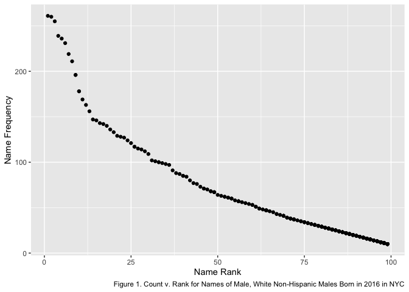

p8105\_hw2\_jae2186
================
jae2186 (Jennifer Estrada)
10/10/2021

## Problem 1

The following code chunk uploads the publicly available data of
Mr. Trashwheel from May 2014 through January 2021 and taken from an
Excel spreadsheet.

The following changes have been made to the data set:

-   non-data entries are omitted (i.e. rows with notes/figures and
    columns containing notes),
-   reasonable variable names have been applied,
-   rows that do not include dumpster-specific data are omitted, and
-   the number of `sports_balls` is rounded to the nearest integer.

``` r
trash_wheel <-
  readxl::read_xlsx("./data/Trash-Wheel-Collection-Totals-7-2020-2.xlsx", 
                    range = "A2:N535") %>% 
  drop_na() %>% 
  janitor::clean_names() %>% 
  rename(volume_cu_yds = volume_cubic_yards) %>% 
  mutate(sports_balls = round(sports_balls, 0)) 
```

The following code chunk reads, cleans, and combines precipitation data
available for 2018 and 2019.

``` r
precip2019 <-
  readxl::read_xlsx("./data/Trash-Wheel-Collection-Totals-7-2020-2.xlsx", 
                    range = "A2:B14",
                    sheet = 6)  %>% 
  janitor::clean_names() %>% 
  drop_na() %>% 
  rename(precip_in = total) %>% 
  mutate (month = month.name[month], year = "2019") %>% 
  relocate(year)

precip2018 <-
  readxl::read_xlsx("./data/Trash-Wheel-Collection-Totals-7-2020-2.xlsx", 
                    range = "A2:B14",
                    sheet = 7)  %>% 
  janitor::clean_names() %>% 
  drop_na() %>% 
  rename(precip_in = total) %>% 
  mutate (month = month.name[month], year = "2018") %>% 
  relocate(year)

all_precip <- bind_rows(precip2018, precip2019)
```

The data set first presented describes the trash collected by
Mr. Trashwheel from mid-May 2014 through January 2021, taking in 453
dumpsters with an average of 3.2 tons of trash per dumpster, ultimately
collecting a total of 1449.7 tons of trash over the course of these
years.

Some quick statistics on the weather conditions and trash collected:

-   <b>Precipitation</b>: Total precipitation in 2018 was 70.33 inches.
    In 2019 33.95 inches of precipitation fell. A total of 104.28 inches
    of precipitation fell over the 2-year observation period noted here.

-   <b>Plastic bottles</b>: There were a over 0.86 million plastic
    bottles collected with a mean of 1899 plastic bottles per dumpster.

-   <b>Glass bottles</b>: Comparatively there were only a total of 10171
    glass bottles collected with a mean of 22.45 glass bottles per
    dumpster.

-   <b> Sports balls</b>: Per dumpster there were an average of 11.75
    sports balls collected by Mr. Trashwheel during this time. When
    broken down for recent years:

    -   In 2018 there were an average of 4.82 sports balls collected per
        dumpster (median of 4 sports balls),
    -   <b>In 2019 there were an average of 10.03 sports balls collected
        per dumpster (median of 9 sports balls),</b>
    -   And in 2020 there were an average of 11.89 sports balls
        collected per dumpster (median of 12 sports balls),

## Problem 2

Data from FiveThirtyEight looking at political party and economics
measures has been uploaded in their respective code chunks:

``` r
pols_month <-
  read_csv("./data/pols-month.csv") %>% 
  mutate(year = 0, month = 0, day = 0) %>% 
  separate(mon, c("year", "month", "day")) %>% 
  mutate(month = as.numeric(month), month = month.name[month], 
         year = as.numeric(year),
         prez = ifelse (prez_gop > 0, "gop", "dem")) %>% 
  select(-day, -prez_gop, -prez_dem) %>% 
  relocate(year, month, prez)
```

``` r
snp <- read_csv("./data/snp.csv") %>% 
  separate(date, c('month', 'day', 'year'), '/') %>% 
  select(-day) %>% 
  mutate(year = as.numeric(year), 
         month = as.numeric(month),
         month = month.name[month],
         year = ifelse(year < 50, year + 2000, year + 1900)) %>% 
  relocate(year, month)
```

``` r
unemploy <-
  read_csv("./data/unemployment.csv") %>% 
  rename(year = Year, 
         January = Jan, February = Feb, 
         March = Mar, April = Apr,
         May = May, June = Jun, 
         July = Jul, August = Aug, 
         September = Sep, October = Oct, 
         November = Nov, December = Dec) %>% 
  pivot_longer(January:December) %>%
  mutate(year = as.numeric(year)) %>%
  rename(month = name) %>% 
  arrange(year)
```

``` r
pol_unemploy <- 
  left_join(pols_month, snp) %>% 
  left_join(unemploy)
```

The first data set entitled `pols_month` provided detailed information
on the political party affiliation with regards to political leaders in
various branches of government within the United States. The data
provided the breakdown of political affiliation (i.e. either republican
party noted as ‘gop’ or democratic party noted as ‘dem’) for the
president as well as giving total counts for the number of senators
(`sen_gop` or `sen_dem`), governors (`gov_gop` or `gov_dem`), and house
representatives (`rep_gop` or `rep_dem`) affiliated with each party. The
data provided monthly information on this political party breakdown,
covering 822 months, starting in January 1947 and going until June 2015.

The second data set then provided dates and closing values (as `close`)
for the Standard & Poor’s stock market index (S&P) with 787 monthly
values (taken on the 15th of each month) that started in July 1950 and
is reported until January 2015.

The third data set provided the monthly rates of unemployment in the US,
covering 816 months of data, starting in January 1948 and reported until
December 2015.

## Problem 3

The following two code chunks produce a table of the annual rank of
popularity of the name “Olivia” with respect to each ethnicity as taken
from the NYC Open data on the popularity of baby names.

``` r
baby_names <-
  read_csv("./data/Popular_Baby_Names.csv") %>% 
  janitor::clean_names() %>% 
  distinct() %>% 
  mutate(ethnicity = replace(ethnicity, 
                             ethnicity == "ASIAN AND PACI", 
                             "ASIAN AND PACIFIC ISLANDER"),
         ethnicity = replace(ethnicity, 
                             ethnicity == "BLACK NON HISP", 
                             "BLACK NON HISPANIC"),
         ethnicity = replace(ethnicity, 
                             ethnicity == "WHITE NON HISP", 
                             "WHITE NON HISPANIC")) %>% 
  arrange(year_of_birth)
```

``` r
olivia <-
  filter(baby_names, childs_first_name == "Olivia") %>% 
  select(-gender, -childs_first_name, -count) %>% 
  pivot_wider(names_from = year_of_birth, values_from = rank)

olivia
```

    ## # A tibble: 4 × 5
    ##   ethnicity                  `2013` `2014` `2015` `2016`
    ##   <chr>                       <dbl>  <dbl>  <dbl>  <dbl>
    ## 1 ASIAN AND PACIFIC ISLANDER      3      1      1      1
    ## 2 BLACK NON HISPANIC              6      8      4      8
    ## 3 HISPANIC                       22     16     16     13
    ## 4 WHITE NON HISPANIC              1      1      1      1

Similarly, the following code chunk results in a table providing the top
names given to male children for each year from 2011 to 2016 and
categorized by ethnicity.

``` r
male_no1 <-
  filter(baby_names, gender == "MALE" & rank == 1) %>% 
  select(-gender, - count, -rank) %>% 
    pivot_wider(names_from = year_of_birth, values_from = childs_first_name)

male_no1
```

    ## # A tibble: 4 × 7
    ##   ethnicity                  `2011`  `2012` `2013` `2014` `2015` `2016`
    ##   <chr>                      <chr>   <chr>  <chr>  <chr>  <chr>  <chr> 
    ## 1 ASIAN AND PACIFIC ISLANDER ETHAN   RYAN   Jayden Jayden Jayden Ethan 
    ## 2 BLACK NON HISPANIC         JAYDEN  JAYDEN Ethan  Ethan  Noah   Noah  
    ## 3 HISPANIC                   JAYDEN  JAYDEN Jayden Liam   Liam   Liam  
    ## 4 WHITE NON HISPANIC         MICHAEL JOSEPH David  Joseph David  Joseph

This last code chunk produces a scatter plot specifically looking at
male, white non-Hispanic children born in 2016 in NYC and compared the
frequency of a name given to a child in this group against the name’s
rank.

``` r
wnh_names <-
  filter(baby_names, gender == "MALE" 
         & ethnicity == "WHITE NON HISPANIC" 
         & year_of_birth == 2016) %>% 
  select(-gender, -ethnicity, -year_of_birth)

ggplot(wnh_names, aes(rank, count)) + 
  geom_point() +
  labs(caption = "Figure 1. Count v. Rank for Names of Male, White Non-Hispanic Males Born in 2016 in NYC", x = "Name Rank", y = "Name Frequency")
```

<!-- -->

``` r
ggsave("p8105_hw2_p3_jae2186.pdf")
```
